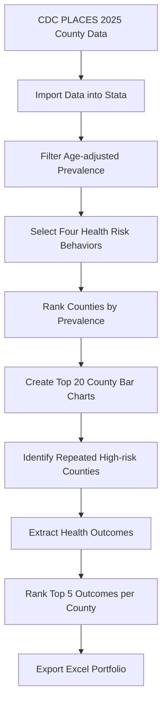

# CDC PLACES County Health Portfolio

## Project Overview

This project uses the CDC PLACES 2025 county-level dataset to identify U.S. counties with the highest age-adjusted prevalence of selected health risk behaviors. The workflow was built in Stata and produces an Excel-based County Health Disparity Portfolio for public health reporting.

The project focuses on four health risk behaviors:

- Binge drinking among adults
- Current cigarette smoking among adults
- No leisure-time physical activity among adults
- Short sleep duration among adults

For each behavior, the workflow ranks counties by age-adjusted prevalence, identifies the top 20 counties, creates bar charts, and exports results into a structured Excel portfolio. It also identifies counties that appear repeatedly across multiple high-risk rankings and summarizes their leading health outcomes.

## Skills Demonstrated

- Public health data analysis
- Reproducible Stata workflow
- Data cleaning and filtering
- County-level health risk ranking
- Loop-based automation
- Excel report generation
- Data visualization
- Project folder organization

## Data Source

Data source: CDC PLACES: Local Data for Better Health, County Data, 2025.

The analysis uses county-level model-based estimates and retains records where the data value type is age-adjusted prevalence.

## Research Questions

1. Which U.S. counties had the highest age-adjusted prevalence of selected health risk behaviors?
2. Which counties appeared repeatedly among the top 20 counties across multiple risk behaviors?
3. What were the leading health outcomes among repeatedly high-risk counties?

## Workflow



## Planned Outputs

- Excel portfolio with five sheets:
  - Binge Drinking
  - Current Smoking
  - Physical Inactivity
  - Short Sleep
  - Health Outcomes
- Bar charts showing the top 20 counties for each health risk behavior
- Summary table of leading health outcomes among repeatedly high-risk counties

## Repository Structure

```text
CDC_places_county_health_portfolio/
│
├── README.md
├── do/
│   ├── 00_master.do
│   ├── 01_clean_places.do
│   └── 02_create_portfolio.do
│
├── data/
│   ├── raw/
│   │   └── README_data_source.md
│   └── processed/
│
├── output/
│   ├── excel/
│   ├── figures/
│   └── logs/
│
└── docs/
```

## Tools

- Stata
- Microsoft Excel
- GitHub

## Notes

This repository is organized as a portfolio version of a public health data workflow. Course-specific files, grading checklists, and internal submission documents are not included.
